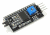

# Monitoratge ambiental amb sensor DHT11 i LCD 16x02

El projecte que presentem consisteix en la implementació d'un sistema de monitoratge ambiental utilitzant un sensor DHT11 i una pantalla LCD 16x2. El sensor DHT11 és capaç de mesurar la temperatura i la humitat de l'ambient en el qual està instal·lat, mentre que la pantalla LCD 16x2 s'utilitza per a visualitzar les dades obtingudes pel sensor.
Per a comunicar tots dos components, s'utilitzarà el protocol de comunicació I2C, que permet la transmissió de dades entre dispositius a través de dos cables: un per a la transmissió de dades (SDA) i un altre per al senyal de rellotge (SCL).
La placa Arduino serà l'encarregada de processar les dades obtingudes pel sensor DHT11 i d'enviar-los a la pantalla LCD 16x2 a través del protocol I2C. D'aquesta manera, es podrà obtindre informació en temps real sobre la temperatura i la humitat de l'ambient monitorat de manera clara i senzilla.

Aquest projecte pot tindre múltiples aplicacions pràctiques, des del monitoratge de la temperatura i humitat en un hivernacle fins al control climàtic en un habitatge. A més, el seu disseny modular i la facilitat d'implementació ho fan ideal per a usuaris amb diferents nivells d'experiència en electrònica i programació.

## Introducció

Per a tirar endavant aquest projecte necessitem entendre primer uns pocs conceptes. Tenim que saber com funciona la comunicació entre els elements del muntatge, per això explicarem què és el bus I2C (un sistema de transmissió de dades per només dos fils). També veurem el mòdul LCD a I2C, un adaptador per convertir una pantalla LCD en un dispositiu compatible amb el protocol I2C. Per finalitzar coneixerem les biblioteques necessàries per fer funcionar tot aquest entramat. En acabar aquesta introducció ens ficarem mans a l’obra amb el muntatge i la programació.

## El bus I2C/TWI

Circuit inter-integrat (I²C, de l'anglés Inter-Integrated Circuit) és un bus serie de dades desenvolupat en 1982 per Philips Semiconductors (hui NXP Semiconductors, part de Qualcomm). S'utilitza principalment internament per a la comunicació entre diferents parts d'un circuit, per exemple, entre un controlador i circuits perifèrics integrats.

L'I²C està dissenyat com un bus mestre-esclau. La transferència de dades és sempre inicialitzada per un mestre; l'esclau reacciona. Una de les propietats de l'I²C és el fet que un microcontrolador pot controlar tota una xarxa de circuits integrats amb només dues I/O-Pins (Input/Output) i un programari molt simple.

Característiques

- Protocol de dos fils de control, un per a transmetre les dades, SDA, i un altre, el rellotge asíncron que indica quan llegir les dades, SCL. Més GND i 5V (quan es requerisca).
- Cada dispositiu connectat al bus I2C i cadascun té la seua adreça exclusiva, de 7 bits, (Així que, en teoria, podem connectar 27 = 128, dispositius).
- Un d'aquests components, ha d'actuar com a màster, és a dir controla el rellotge.
- No es requereix una velocitat de rellotge estricta, ja que és el màster qui controla el Clock.
- És multi màster, el màster pot canviar, però només un pot estar actiu un alhora.


La idea és que tots els components es connecten en paral·lel a les dues línies del Bus, SDA i SCL.

- Fixar-vos també que hi ha unes resistències de Pullup connectades a SDA i SCL. Són imperatives, ja que el bus és actiu baix (Això és, el senyal actiu és un 0, no un 1.)
- Quan vages a connectar alguna cosa al bus I2C, és imprescindible que lliges el manual per a saber si els pullups els has de posar tu, o venen llocs en el component.
- En el cas del display I2C que usarem, normalment inclouen els pullups.

### Arduino i el bus I2C/TWI

Les plaques arduino tenen predefinits uns pins per a les funcions SDA i SCL.

- Arduino UNO, nano i mini, els pins analògics A4 (SDA) i A5 (SCL).
- Arduino Mega i DUE, els pins 20 (SDA) i 21 (SCL).
- Per altra banda, la llibreria «Wire» gestiona el protocol de comunicacions complet.

## Mòdul adaptador I2C a LCD

El Mòdul adaptador LCD a I2C que usarem està basat en el controlador I2C PCF8574, el qual és un Expansor d'Entrades i Eixides digitals controlat per I2C. Pel disseny del PCB aquest mòdul s'usa especialment per a controlar un LCD Alfanumèric.

La direcció I2C per defecte del mòdul pot ser 0x3F o en altres casos 0x27. És molt important identificar correctament la direcció I2C de nostre module, perquè d'una altra forma el nostre programa no funcionarà correctament. Per a identificar la direcció especifica del nostre mòdul podem utilitzar un xicotet sketch de prova anomenat: **i2c_scanner**, el qual ens permet identificar la direcció I2C del dispositiu connectat al Arduino. Per poder-lo pujar a una placa arduino hi ha que instal·lar la llibreria I2CScanner des del _«Gestor de biblioteques»_ i burcar-lo en _«Exemples»_.

Si en cas existira la necessitat de treballar amb més d'un LCD podem modificar la direcció I2C del module adaptador. Per a això és necessari soldar els ponts A0, A1 i A2 presents en el mòdul, aquests tres ponts són els bits menys significatius de la direcció I2C del mòdul. La direcció 0x3F en binari seria: 0|0|1|1|1|A2|A1|A0 i la direcció 0x27: 0|0|1|0|0|A2|A1|A0. Per defecte A0, A2, A1 valen 1 però si soldem els ponts, aquests es connecten a terra tenint un valor 0. Per exemple si soldem els tres ponts la nova direcció seria 0|0|1|0|0|0|0|0 (0x20), per a un xip que anteriorment era 0x27.


Per a controlar el contrast dels dígits en el LCD només necessitem girar el potenciòmetre que es troba en el mòdul, fins a quedar conformes amb el contrast mostrat.

La llum de fons es controla principalment per programari des del Arduino, però el mòdul també permet desconnectar el Led de la llum de fons removent un jumper LED.

### Connexions entre Arduino i Mòdul adaptador LCD a I2C

L'adaptador LCD a I2C té els pins ordenats per a connectar directament al LCD, això el podem fer a través d'un protoboard o soldant directament al LCD.


Per a connectar amb el module amb el Arduino només utilitzem els pins I2C del Arduino (SDA i SCL) i alimentació (GND i 5V), els pins I2C varien d'acord amb el model de Arduino amb el qual treballem, en la següent taula podem veure quals són els pins I2C per a cada model de Arduino.

| Adaptador LCD a I2C | Arduino Uno, Nano, Mini. | Arduino Mega , DUE | Arduino Leonardo |
| ------------------- | ------------------------ | ------------------ | ---------------- |
| GND                 | GND                      | GND                | GND              |
| VCC                 | 5V                       | 5V                 | 5V               |
| SDA                 | A4                       | 20                 | 2                |
| SCL                 | A5                       | 21                 | 3                |

## Biblioteques

Per a poder fer funcionar tots els elements ens cal l’ajuda de tres bibioteques: Wire, LiquidCrystal\*I2C, i DHT. Wire i DHT estàn integrades en el IDE arduino, si no ho estàn hi ha que instalar-les des de la opció _«Eines>Gestiona les biblioteques»_ i buscar _«DHT sensor library (by Adafruit)»_.

Podem descarregar-les fent clic a l’enllaç. Guardem el fixer .zip que apareix i l’instalem directament des de _«Esbós>Inclou la biblioteca>Afegeix una biblioteca .ZIP»_

Enllaços de descàrrega:

- Biblioteca
  - [LiquidCrystal_I2C](https://drive.google.com/file/d/1BFlSsQ7-mT_ligNyyFKf7ugaQQiL539x/view?usp=sharing)
  - [DHT11](https://drive.google.com/file/d/18HekZKorTE1kJDjlcbEhC1fjdoZ_wC05/view?usp=sharing)
- Documentació
  - [LiquidCrystal_I2C](https://qode66.github.io/arduino-biblioteques/)
  - [DHT11](https://qode66.github.io/arduino-biblioteques/)
  - [Wire](https://qode66.github.io/arduino-biblioteques/)

## Material

|                    Imatge                    | Descripció                                               |
| :------------------------------------------: | :------------------------------------------------------- |
|      | Arduino UNO o similar                                    |
|  | Placa protoboard                                         |
|          | Uns quants cables                                        |
|            | Sensor DHT11                                             |
|          | Pantalla LCD 16x02. Pot portar acoplat el mòdul I2C LCD. |
|   | Mòdul I2C LCD, si la pantalla no el porta acoplat.       |

## Muntatge

En aquest cas vaig a utilitzar una placa Arduino nano, però el muntatge és semblant si s’utilitza la placa Arduino UNO, simplement canvien de lloc els pins. La numeració o identificació és la mateixa.
El mòdul I2C LCD pot estar o no acoplat a la pantalla. En el meu cas tots dos elements estàn units. Si els aparells es troben separats caldrà fixar-los a la protoboard de manera que el seus pins queden connectats.


## Programació

Codi: dht11ToLcdI2c.ino

```Arduino
/*
 * CARTROTECH  (cartrotech.github.io)
 *
 * Projecte nº: P01
 * Descripcio: Llegir les dades d'un sensor DHT11 i presentarles en una pantalla LCD 16x02
 * mitjançant el modul de comunicacio I2C
 * Codi per a la placa que rep les dades del sensor DHT11 i goberna el LCD 1602
 *
 * 22.08.2021
 */

#include <Wire.h>
#include <LiquidCrystal_I2C.h>
#include <DHT.h>

#define DHTPIN 2                     //Pin digital connectat al sensor DHT
#define DHTTYPE DHT11                //Tipus de sensor

DHT dht(DHTPIN, DHTTYPE);            //Declara l'objecte DHT amb el parametres PIN i TYPE
LiquidCrystal_I2C lcd(0x27, 16, 2);  //Crea l'objecte lcd amb direcció 0x27, 16 caracters y 2 línees


void setup()
{
  Serial.begin(9600);  // Obre i configura monitor serie a 9600 bps
  Wire.begin();        // unir-se al bus i2c com master
  lcd.begin();         //Inicialitza l'objecte lcd
  lcd.backlight();
  dht.begin();         //Inicialitza l'objecte DHT
}

void loop()
{
  delay(2000);  //Espera 2 seg entre mesures

  float h = dht.readHumidity();         //Llig l'humitat
  float t = dht.readTemperature();      //Llig la temperatura en Celsius
  if (isnan(h) || isnan(t))             //Comprova que no hi ha error
    {
      lcd.clear();
      lcd.println("Fallo llegint sensor DHT!");
      return;
    }
  float hic = dht.computeHeatIndex(t, h, false);    //Calcula index de calor en Celsius
  tempinlcd(h, t, hic);                             //Crida a la funcio que presenta en pantalla
}

void tempinlcd(float HR, float TC, float IC)    //Funcio que controla la presentacio en pantalla
{
  char lcdTC[5];
  char lcdHR[5];
  char lcdIC[5];

  lcd.setCursor(0,0);
  lcd.print("T: ");
  dtostrf(TC,4,1,lcdTC);
  lcd.print(lcdTC);

  lcd.setCursor(8,0);
  lcd.print("H: ");
  dtostrf(HR,4,1,lcdHR);
  lcd.print(lcdHR);

  lcd.setCursor(0,1);
  lcd.print("IC: ");
  dtostrf(IC,4,1,lcdIC);
  lcd.print(lcdIC);
}
```

[](./Videos/DHT%20a%20LCD%20I2C.mp4)

Feu clic en la imatge si voleu veure un video curt del muntatge.

## Referencies

1. Viquipèdia, [I²C](https://ca.wikipedia.org/wiki/I%C2%B2C), 5 set 2021 a les 23:20.
2. Viquipèdia, [Arduino](https://ca.wikipedia.org/wiki/Arduino), 26 set 2021 a les 11:06.
3. Handson Technology, [User Guide I2C Serial Interface 1602 LCD Module](https://handsontec.com/dataspecs/module/I2C_1602_LCD.pdf)
4. Codi: [dht11ToLcdI2c.ino](https://drive.google.com/file/d/1I0h_H0Swx1_FAy56nTF0PkC_PMfDOrsm/view?usp=sharing)
